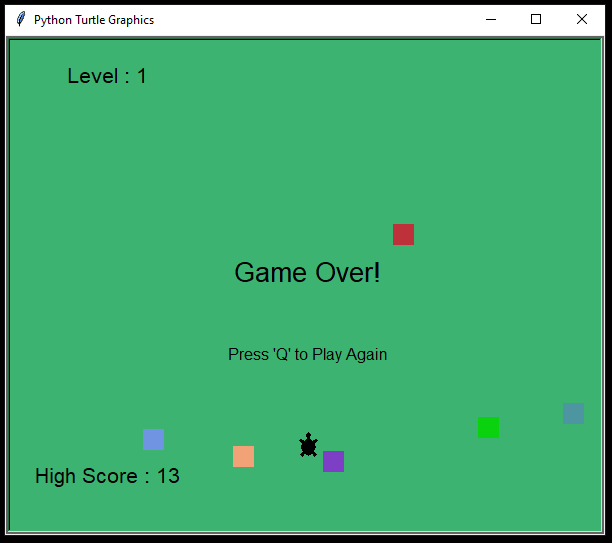

# Turtle-Crossing-Game

Instructions:
Move the turtle to the opposite side.
If the turtle hits a vehicle the game will end.
Turtle can only move forward.
Speed and the number of vehicles will increase as you go to higher levels.

