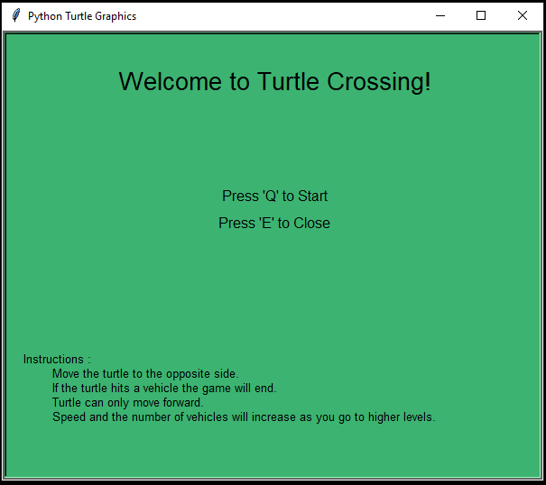

# Turtle-Crossing-Game

Instructions:
<ul>
  <li>Move the turtle to the opposite side.</li>
  <li>If the turtle hits a vehicle the game will end</li>
  <li>Turtle can only move forward.</li>
  <li>Speed and the number of vehicles will increase as you go to higher levels.</li>
</ul>

